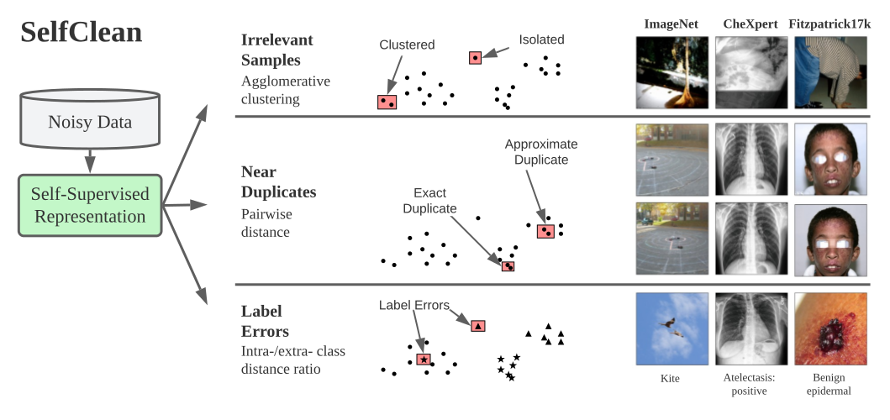

# Revised Benchmarks using SelfClean

<p align="center">
  
</p>

[**SelfClean Paper**](https://arxiv.org/abs/2305.17048) 

This repository contains revised versions of benchmark datasets created using the SelfClean data cleaning protocol and expert annotators.
These revised file lists should be used for model evaluation and pave the way for more trustworthy performance assessment across domains.

## Data Cleaning Protocol

The data cleaning protocol that produces the revised benchmarks combines an existing algorithmic cleaning strategy to find candidate issues with an interpretable stopping criterion for efficient annotation.

**1. Ranking candidate data quality issues:**  
We leverage SelfClean to find potential data quality issues in benchmark datasets. 
SelfClean is a holistic data-cleaning framework based on recent self-supervised learning (SSL) advances.
It targets the detection of irrelevant samples, near duplicates, and label errors.
For each noise type, SelfClean yields a sorted list of all samples (or pairs thereof), where items appearing earlier in the sequence are more likely to manifest data quality issues.

**2. Confirming data quality issues:**   
We present the rankings obtained with SelfClean for each dataset and noise type to human annotators for confirmation.
We rely on practicing experts for confirmation for the domains requiring in-depth expertise.   
To overcome the challenge of thoroughly verifying issues in all dataset samples, especially for near duplicates, we propose a conservative and intuitive stopping criterion to terminate the annotation process before the dataset is exhaustively covered.
Specifically, we rank samples using SelfClean and stop the annotation process after receiving $n_{\text{clean}}$ consecutive negative responses.
We set $n_{\text{clean}}$ by requesting that the probability of observing the sequence of negative annotations as a result of chance be lower than $p_\text{chance}$, where the probability for each sample to be a data quality issue is $p_+$ (or less).
This yields $n_{\text{clean}} = \lfloor \ln(p_\text{chance})/\ln(1 - p_+) \rfloor$, where in this work we set $p_\text{chance} = p_+ = 0.05$, resulting in $n_{\text{clean}} = 58$.

**3. Cleaning data quality issues**  
After the confirmation process, we conservatively require unanimous expert agreement to identify an issue. 
Specifically, a sample is considered noise only if all experts flag it as such. 
We then produce cleaned benchmark datasets by discarding confirmed irrelevant samples and randomly removing a sample for each confirmed pair of near duplicates.

## Revised Benchmarks

### Dermatology

The table below lists the expert-confirmed data quality issues found in six dermatology benchmarks for all three noise types obtained by unanimous expert agreement.

Revised file lists include the file names of valid images from the original dataset, excluding irrelevant and near-duplicate samples.
Label errors are not corrected as this would unfairly favor models similar to the SelfClean encoder, but their prevalence is reported, which can be used to infer the level of performance saturation due to label quality.

| Dataset | Size  | Irrelevant Samples | Near Duplicates | Label Errors |
| :---: | :---: | :---: | :---: | :---: | 
| MED-NODE | 170  | 3 (1.8%) | 1 (0.6%) | 2 (1.2%) |
| PH2 | 200 | 0 (0.0%) | 0 (0.0%) | 0 (0.0%) |
| DDI | 656 | 3 (0.5%) | 6 (0.9%) | 8 (1.2%) |
| Derm7pt | 2,022 | 1 (0.1%) | 9 (0.5%) | 2 (0.1%) |
| PAD-UFES-20 | 2,298 | 2 (0.1%) | 56 (2.4%) | 3 (0.1%) |
| SD-128 | 5,619 | 3 (0.1%) | 156 (2.8%) | 4 (0.1%) |

## References

Please cite the following work if you find this repository useful for your research or use one of the revised file lists.

```bib
@misc{groger_selfclean_2023,
  title        = {{SelfClean}: {A} {Self}-{Supervised} {Data} {Cleaning} {Strategy}},
  shorttitle   = {{SelfClean}},
  author       = {Gröger, Fabian and Lionetti, Simone and Gottfrois, Philippe and Gonzalez-Jimenez, Alvaro and Amruthalingam, Ludovic and Consortium, Labelling and Groh, Matthew and Navarini, Alexander A. and Pouly, Marc},
  year         = 2023,
}
```